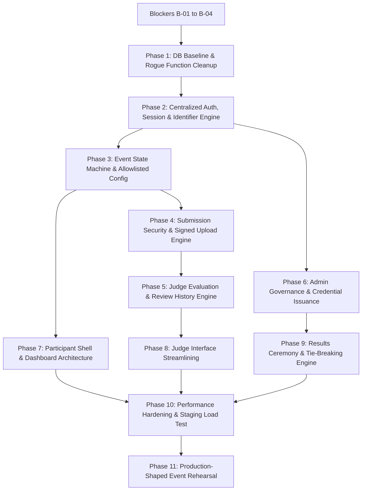

# CODE-e-MANIPAL 2.0 — IMPLEMENTATION BASELINE (v4 FINAL)

> **MANDATORY POLICY STATEMENT**:  
> **No application code, database migration, dependency update, configuration change, or file modification is permitted during this review pass.**  
> This document represents the approved architectural and operational baseline. Implementation remains strictly gated behind pre-implementation blockers (B-01 through B-04) and requires explicit phase-by-phase authorization.

---

# 1. FINAL ARCHITECTURE DECISIONS (ADRs)

### ADR-001: Sole Authoritative Role Architecture
* **Decision**: `public.profiles.role` is the **SOLE AUTHORITATIVE** source of truth for all role-based authorization decisions across the application.
* **Mechanism**: Every server-side authorization guard queries or verifies `public.profiles.role` directly. Supabase Auth metadata (`user_metadata` or `app_metadata`) is treated **strictly as a non-authoritative client-side UI convenience cache** (e.g., for optimistic rendering of navigation bars).
* **Discrepancy Resolution**: In any scenario where `profiles.role != user_metadata.role`, `profiles.role` unconditionally governs authorization. The system does not depend on dual-write synchronization between Postgres and GoTrue.
* **Status**: **LOCKED**.

### ADR-002: Direct Azure Postgres Access & Database Security Phasing
* **Architecture Evaluation**:
  * **Option A**: Azure Postgres + direct `pg` connection pool + service-layer authorization.
  * **Option B**: Complete migration to Supabase PostgREST + Supabase Row Level Security (RLS).
  * **Option C**: Azure Postgres + direct `pg` + dedicated least-privilege SQL role (`GRANT SELECT, INSERT, UPDATE` with DDL revoked) + service-layer authorization.
* **Decision**:
  * **Pre-Event (Current Scope)**: **Option A** is maintained. An architectural rewrite of the entire data-access layer to PostgREST/RLS days prior to a live hackathon introduces unacceptable regression risk. Database security depends on hardened, centralized service-layer guards.
  * **Post-Event (Hardening Path)**: **Option C** is formally scheduled for post-event infrastructure hardening to provide database defense-in-depth.
  * **Security Clarification**: The storage layer is explicitly not described as "intrinsically safe" merely because service-layer authorization exists; authorization is strictly application-enforced pre-event.
* **Status**: **LOCKED FOR EVENT**.

### ADR-003: Authentication Identity Format for Pre-Provisioned Accounts
* **Candidates**:
  * Option A: Synthetic email format `team-xxx@cem.local`
  * Option B: Delegated subdomain `team-xxx@auth.codeemanipal.in`
  * Option C: Direct Supabase username authentication
* **Decision**: **KEPT OPEN AS PRE-IMPLEMENTATION BLOCKER (B-01)**.
  * `cem.local` shall **NOT** be coded or deployed until behavior is validated in a non-production Supabase project.
  * Verification must prove: (1) Supabase Admin API creation with email confirmation bypass, (2) format validator acceptance of synthetic TLDs, (3) absence of unintended SMTP dispatch, (4) password reset behavior, (5) uniqueness enforcement.
* **Status**: **OPEN / PENDING NON-PROD VERIFICATION (B-01)**.

### ADR-004: Event Phase & Results Release Model Separation (Pure Read-Only GET)
* **Problem**: Prior implementation conflated the strict 7-phase event state machine with the results publishing buffer, mutated database state inside `GET /api/event-config`, left a race condition where effective `PUBLISHED` could be reached before the snapshot was materialized, and allowed reviews to change after snapshot generation.
* **Decision**: **Separation of Event Phase from Results Release State + Pre-Materialized Results Snapshot + Review Freeze in RESULTS + Pure Read-Only GET**.
  * **Model Separation**:
    * `event_phase`: Strict 7-state machine (`NOT_STARTED`, `HACKING`, `SUBMISSION`, `SUBMISSION_CLOSED`, `JUDGING`, `RESULTS`, `ENDED`).
    * `results_release`: State enum (`DRAFT`, `PUBLISHING`, `PUBLISHED`).
    * `publish_at`: `TIMESTAMPTZ NULL` (target timestamp for automated release).
    * `buffer_minutes`: `INT NOT NULL DEFAULT 5` (admin-configurable buffer, bounded 1–60 minutes, audited on edit).
    * `active_release_id`: `UUID NULL REFERENCES results_snapshot(release_id)` (authoritative pointer to active release).
  * **Post-Judging Review Freeze & Atomic Rollback State Reset**:
    * Once `event_phase = 'RESULTS'`, **all judge reviews become 100% immutable**, including to admins through the normal reopen path.
    * Post-snapshot corrections are strictly barred during `RESULTS`. If an exceptional correction is required, the system enforces the audited rollback procedure:
      1. Invalidate `active_release_id` in `audit_logs`.
      2. Atomically reset event configuration:
         ```sql
         UPDATE event_config SET
           event_phase = 'JUDGING',
           results_release = 'DRAFT',
           publish_at = NULL,
           active_release_id = NULL,
           updated_at = NOW();
         ```
         Prior rows in `results_snapshot` and `results_awards` remain permanently preserved for audit and historical integrity.
      3. Perform review correction in `JUDGING` phase $\rightarrow$ pass `requireJudgingComplete()` gate $\rightarrow$ trigger new Publish $\rightarrow$ generate new `release_id` and snapshot $\rightarrow$ initiate new buffer.
  * **Judging Completion Gate (`requireJudgingComplete`)**:
    * Verifies two strict criteria:
      1. **Assignment Completeness**: Every eligible participating team (excluding teams explicitly marked disqualified or withdrawn) has the full required quota of judge assignments per rubric configuration.
      2. **Evaluation Completeness**: Every required assignment has a finalized submitted review (`status = 'submitted'`, zero dangling drafts).
    * **Emergency State Transition vs. Publish Invariant**:
      * Emergency override `PATCH /api/admin/event-config/override-state` permits admins to force `event_phase = 'RESULTS'` for operational coordination with a mandatory `reason` and audit record.
      * **CRITICAL INVARIANT**: Forcing the state machine into `RESULTS` does **NOT** make incomplete judging publishable. `POST /api/admin/event-config/publish` unconditionally and independently enforces `requireJudgingComplete()`.
  * **Idempotent & Concurrency-Safe Publishing Workflow**:
    1. During `RESULTS` phase, admin triggers publication via `POST /api/admin/event-config/publish`.
    2. **Row Locking & Concurrency Check**: The transaction executes `SELECT * FROM event_config FOR UPDATE`.
       * If `event_phase != 'RESULTS'`: Aborts with `400 Bad Request`.
    3. **Effective State & Idempotency Evaluation**: The endpoint evaluates `getEffectiveResultsRelease(config, new Date())`:
       * If effective status is `'PUBLISHED'` (including when stored is `'PUBLISHING'` but `now >= publish_at`): Returns existing published results (`200 OK`) without regenerating.
       * If effective status is `'PUBLISHING'`: Returns existing active release countdown target (`200 OK`) without regenerating.
    4. **Independent Judging Completion Gate**: If effective status is `'DRAFT'`, the endpoint strictly verifies `requireJudgingComplete()`. If any eligible team lacks required assignments or has unsubmitted reviews, publication **aborts with `400 Bad Request ("Cannot publish results: judging is incomplete")`**.
    5. **Atomic Snapshot Generation**: Generates unique `release_id UUID DEFAULT gen_random_uuid()`, aggregates final review scores according to preserved rubric weights, materializes an **immutable mathematical `results_snapshot` record in the database before the countdown starts**, initializes `results_awards(release_id)`, and sets `active_release_id = release_id`.
    6. The transaction updates `results_release = 'PUBLISHING'` and `publish_at = NOW() + (event_config.buffer_minutes * INTERVAL '1 minute')`.
  * **Unified Effective Release Helper**:
    * Both `GET /api/event-config` and `GET /api/results` evaluate status via the identical shared server helper:
      ```ts
      export function getEffectiveResultsRelease(config: EventConfig, now: Date): 'DRAFT' | 'PUBLISHING' | 'PUBLISHED' {
        if (config.event_phase !== 'RESULTS') return 'DRAFT';
        if (config.results_release === 'PUBLISHING') {
          if (!config.publish_at) {
            console.error('CRITICAL: results_release is PUBLISHING but publish_at is null');
            return 'DRAFT'; // Fail closed
          }
          if (now >= new Date(config.publish_at)) {
            return 'PUBLISHED';
          }
        }
        return config.results_release;
      }
      ```
  * **Background Publish Worker Reconciliation Guard**:
    * While the GET path calculates effective release deterministically, an asynchronous background worker or cron reconciles `results_release` in the database once `NOW() >= publish_at`.
    * **Strict Release-Binding Invariant**: The worker must be bound to the specific `release_id` it was scheduled for and execute a conditional, idempotent update:
      ```sql
      UPDATE event_config
      SET results_release = 'PUBLISHED',
          updated_at = NOW()
      WHERE event_phase = 'RESULTS'
        AND results_release = 'PUBLISHING'
        AND active_release_id = $release_id
        AND publish_at IS NOT NULL
        AND NOW() >= publish_at;
      ```
    * If zero rows are updated (e.g., the release was cancelled or rolled back to `JUDGING`), the worker exits cleanly without mutating state. The worker is completely idempotent and safe to retry.
  * **Global Transactional Phase Invariant (Anti-TOCTOU Serialization)**:
    * To prevent time-of-check to time-of-use (TOCTOU) race conditions between application route guards and transaction commit (e.g., an autosave begins during `JUDGING`, an admin transitions `JUDGING -> RESULTS`, and the review writes after the freeze; or a participant finalizes a submission right as the phase transitions to `SUBMISSION_CLOSED`):
    * **Every phase-sensitive business mutation must lock and verify `event_config` inside its explicit transaction**:
      ```sql
      BEGIN;
      SELECT event_phase FROM event_config FOR UPDATE;
      -- verify event_phase matches required phase (e.g., 'JUDGING' or 'SUBMISSION'), else ROLLBACK and return 403 Forbidden
      -- perform row-locked mutation
      COMMIT;
      ```
    * This serializes state transitions and concurrent business operations against each other.
  * **Serialization Failure & Deadlock Retry Invariant**:
    * All transactions utilizing row locks or serializable isolation must catch Postgres serialization failures (code `40001`) and deadlocks (code `40P01`).
    * The database transaction helper automatically retries the operation up to **3 times** with exponential backoff and randomized jitter (50ms–200ms).
    * If retries are exhausted, the operation aborts cleanly and returns **`409 Conflict`** (or `503 Service Unavailable`), preventing partial writes or silent data corruption.
  * **Public Response Allowlist**: The public/authenticated GET endpoint returns **only**:
    * `event_phase` (strict state)
    * `results_release` (effective publication state: `DRAFT`, `PUBLISHING`, `PUBLISHED`)
    * `start_time`, `end_time`
    * `publish_at`
    * `countdown_target`
    * `announcements` (public flag = true)
    * `active_round`
  * **Forbidden from Public Response**: Internal admin notes, server infrastructure identifiers, database connection parameters, secret tokens, and unpublished scoring configurations.
* **Status**: **LOCKED**.

### ADR-005: Score Versioning, History Preservation & Concurrency Semantics
* **Decision**: **Dedicated `review_history` Table with Strict Referential Integrity & Concurrency Controls**.
* **Rationale**: Admin score overrides and judge corrections must be auditable, queryable, and reportable directly in administrative evaluation views without parsing unstructured audit strings. Historical score records must never be lost.
* **Schema & Integrity**:
  ```sql
  CREATE TABLE review_history (
    id UUID PRIMARY KEY DEFAULT gen_random_uuid(),
    review_id UUID NOT NULL REFERENCES reviews(id) ON DELETE RESTRICT,
    team_id UUID NOT NULL REFERENCES teams(id) ON DELETE RESTRICT,
    judge_id UUID NOT NULL REFERENCES profiles(id) ON DELETE RESTRICT,
    round VARCHAR(50) NOT NULL,
    version INT NOT NULL DEFAULT 1,
    previous_scores JSONB NOT NULL,
    previous_feedback TEXT,
    changed_by UUID NOT NULL REFERENCES profiles(id) ON DELETE RESTRICT,
    changed_at TIMESTAMPTZ NOT NULL DEFAULT NOW(),
    reason TEXT NOT NULL
  );
  CREATE INDEX idx_review_history_team ON review_history(team_id);
  CREATE INDEX idx_review_history_review ON review_history(review_id);
  ```
* **Immutability & Integrity**: `ON DELETE RESTRICT` guarantees that deleting a team, judge, or review will fail if historical score revisions exist. Profiles and teams are archived or disabled (`is_disabled = true`), never deleted.
* **Transactional & Optimistic Concurrency Semantics**: All score updates and admin reopen operations must execute within an explicit database transaction utilizing row-level locking and optimistic version checking:
  * **Optimistic Version Verification**: Client requests include `expected_version: number`.
  * The server acquires row lock: `SELECT * FROM reviews WHERE id = $1 FOR UPDATE`.
  * If `reviews.version != expected_version`, the transaction aborts and returns **`409 Conflict ("Review was modified in another session. Please refresh to load the latest scores.")`**, preventing silent overwrites during autosave.
  * If valid, archives current record into `review_history` with `version`, applies new scores, and sets `version = version + 1`.
  ```sql
  BEGIN;
  SELECT * FROM reviews WHERE id = $1 FOR UPDATE;
  -- verify current version == expected_version, else ROLLBACK & return 409
  INSERT INTO review_history (review_id, team_id, judge_id, round, version, previous_scores, previous_feedback, changed_by, reason)
  VALUES ($1, ..., current_version, current_scores, current_feedback, $admin_id, $reason);
  UPDATE reviews SET scores = $new_scores, version = version + 1, updated_at = NOW() WHERE id = $1;
  COMMIT;
  ```
* **Single Path Administrative Modification**: Admins cannot modify `reviews` through any generic update route. All administrative score corrections must route through the dedicated `/api/admin/reviews/[id]/reopen` or `/override` workflow, which enforces mandatory reasoning, version incrementing, and `review_history` archival.
* **Status**: **LOCKED**.

### ADR-006: Temporary Password Specification, Credential Lifecycle & Admin Separation
* **Decision & Language**:
  * 6-character unambiguous alphanumeric credentials (e.g., `A9K2M4`) are accepted strictly as an **event-operational credential format** for printed team and judge badges.
  * **Charset Specification**: 31 uppercase characters and numerals excluding ambiguous glyphs: `[2-9A-HJKMNP-Z]` (`2-9` [8], `A-H` [8], `J,K,M,N` [4], `P-Z` [11]; excluding `0`, `O`, `1`, `I`, `L`).
  * **Entropy & Security Reality**: With 31 characters, $31^6 = 887,503,681$ combinations (~29.7 bits of entropy). This is not intrinsically secure against offline brute-force; **security depends on server-side rate limiting, credential secrecy, rapid session revocation, pre-provisioning, and limited event lifetime**.
  * **Strict Separation of Admin Credentials**: The 6-character format applies **only to participants and judges**. Administrative accounts (`ADMIN-XX`) must use minimum 16+ character high-entropy credentials generated cryptographically and managed via Azure Key Vault / secure password manager. Admin accounts are **never** provisioned via the 6-character badge generator.
  * **Credential Lifecycle**: Participant and judge credentials remain active strictly for the duration of the event. Upon reaching phase `ENDED`, participant and judge profiles are disabled (`is_disabled = true`) or sessions revoked to prevent post-event credential reuse.
* **Status**: **LOCKED**.

### ADR-007: Defense-in-Depth Login Throttling & Campus-NAT-Safe Rate Limiting
* **Specification**:
  * **Layer 1: Per-Account Progressive Delay (Primary Anti-Brute-Force Control)**:
    * Rolling 15-minute window per canonical identifier.
    * Attempts 1–3: 0ms delay (instantaneous).
    * Attempts 4–5: 1,000ms server-side sleep before response.
    * Attempts 6–10: 3,000ms server-side sleep + security notice in payload.
    * Attempts 11+: 5,000ms server-side sleep.
    * **No Hard Lockout**: Eliminates denial-of-service vulnerability against legitimate teams.
    * **Admin Reset**: Helpdesk admins can reset an account's failed attempt counter instantly via `/admin/users`.
  * **Layer 2: Campus-NAT-Safe Coarse IP / Endpoint Rate Limiter**:
    * Coarse token-bucket / burst limiter enforced at application/edge layer on `/api/auth/login`.
    * **Campus-NAT Calibration**: To prevent denying service to 50–100 legitimate teams authenticating simultaneously behind a single shared campus Wi-Fi NAT IP, thresholds are **not hardcoded to low limits (e.g. 30/min)**. Instead, thresholds are configurable and calibrated during staging tests under simulated shared-NAT burst traffic to absorb legitimate surges while blocking massive automated credential-stuffing floods.
  * **Enumeration Resistance**: Generic response on all failures: `"Invalid identifier or password."`
* **Status**: **LOCKED**.

### ADR-008: Login Attempt Telemetry & Privacy Minimization
* **Specification**:
  * Table: `login_attempts`
  * Stored fields: `id, identity_key, attempted_at, success (BOOLEAN), ip_hash, user_agent_summary`.
  * **IP Hash Definition**: First 16 hexadecimal characters of `HMAC_SHA256(client_ip, daily_rotating_server_salt)`. Raw IP addresses are **never stored**.
  * **Threat Model Clarification**: The hashed IP is retained **only as a limited forensic and correlation signal** to investigate localized repeat failures. It is explicitly **not relied upon as a primary defense against distributed credential stuffing**.
  * **User-Agent Normalization**: Normalized to family and platform (e.g., `Chrome/Windows`, `Safari/iOS`) truncated to maximum 64 characters; raw user-agent strings discarded.
  * **Retention & Visibility**: Automatic rolling purge after 7 days via scheduled cleanup. Data is strictly restricted to `admin` role and completely invisible to participant and judge APIs.
* **Status**: **LOCKED**.

### ADR-009: Account Identifier Normalization & Database Column Specification
* **Pipeline**: All user-entered identifiers must pass through a strict canonical normalization pipeline before database lookup or authentication:
  $$\text{Raw Input} \xrightarrow{\text{Trim Whitespace}} \xrightarrow{\text{Uppercase}} \xrightarrow{\text{Regex Validation}} \text{Canonical Identifier}$$
* **Format Regex**:
  * Participants: `^TEAM-[0-9]{3}$` (e.g., `TEAM-001`, `TEAM-042`)
  * Judges: `^JUDGE-[0-9]{2}$` (e.g., `JUDGE-01`, `JUDGE-12`)
  * Admins: `^ADMIN-[0-9]{2}$` (e.g., `ADMIN-01`)
* **Integrity & Concrete Database Target**: Prevents edge-case authentication failures caused by leading/trailing spaces or lowercase entries (`team-001` vs `TEAM-001`). Enforced via canonical column `profiles.identifier VARCHAR(50) UNIQUE NOT NULL` and unique index `idx_profiles_identifier_unique` on `UPPER(TRIM(identifier))`.
* **Status**: **LOCKED**.

### ADR-010: Audit Log Architecture & Application Immutability
* **Definition**: Audit logs are **append-only through the application** and have **no update or delete application routes**.
* **Storage Clarification**: While direct `pg` access without database-level role restrictions means true storage-layer immutability is deferred to post-event Option C, the application layer guarantees zero write/mutation endpoints for `audit_logs`.
* **Status**: **LOCKED**.

### ADR-011: Results Deterministic Ranking, Separated Award Overlay & Review Disclosure Policy
* **HTTP Status Contract**:
  * `401 Unauthorized`: Unauthenticated request where session is required.
  * `403 Forbidden`: Authenticated, but results not yet released (`results_release != 'PUBLISHED'`, unless requester is `admin`).
  * `200 OK`: Results released; returns ordered leaderboard payload combined with finalized awards.
* **Preservation of Existing Scoring Formula & Aggregation Rule**:
  * Existing judging aggregation and rubric weights must be inspected and preserved unless explicitly replaced by organizer-approved configuration. Phase 9 must document the exact aggregation formula and criterion weights (e.g., arithmetic mean across all assigned judges, criterion weighted sums, and verification that incomplete judging is barred by the completion gate) before implementation.
* **Deterministic Ranking Engine**:
  1. Primary: Highest total aggregated evaluation score across all judging criteria.
  2. Tie-Breaker 1: Highest score on designated primary rubric criterion ("Innovation & Technical Complexity").
  3. Tie-Breaker 2: Timestamp of final project submission (`final_submitted_at`; earlier final submission wins).
* **Separation of Mathematical Snapshot vs. Pre-Publication Award Overlay**:
  * To uphold write-once immutability without sacrificing operational ceremony flexibility, mathematical rankings and ceremony metadata are decoupled into two distinct tables:
    * **`results_snapshot`**: Write-once mathematical ranking generated atomically upon clicking Publish:
      ```sql
      CREATE TABLE results_snapshot (
        id UUID PRIMARY KEY DEFAULT gen_random_uuid(),
        release_id UUID UNIQUE NOT NULL,
        snapshot_payload JSONB NOT NULL,
        created_at TIMESTAMPTZ NOT NULL DEFAULT NOW(),
        created_by UUID NOT NULL REFERENCES profiles(id) ON DELETE RESTRICT
      );
      ```
    * **`results_awards`**: Dedicated ceremony presentation metadata table:
      ```sql
      CREATE TABLE results_awards (
        id UUID PRIMARY KEY DEFAULT gen_random_uuid(),
        release_id UUID UNIQUE NOT NULL REFERENCES results_snapshot(release_id) ON DELETE RESTRICT,
        award_overlay JSONB NOT NULL DEFAULT '{}'::jsonb,
        updated_at TIMESTAMPTZ NOT NULL DEFAULT NOW(),
        updated_by UUID NOT NULL REFERENCES profiles(id) ON DELETE RESTRICT
      );
      ```
  * **Lifecycle & Effective Publish Lock**:
    * `results_snapshot` is **strictly write-once** with zero application update/delete routes.
    * Award edit authorization uses `getEffectiveResultsRelease(config, new Date())`: `results_awards` is **editable by admins strictly while effective release is `'PUBLISHING'`** (during the countdown buffer), allowing ceremony organizers to assign joint awards or special commendations (e.g., Team A and Team B as "Joint 1st Place Winners") with mandatory administrative reasoning.
    * **Effective Publish Time Locking**: Crucially, **the moment `NOW() >= publish_at` (effective release becomes `'PUBLISHED'`), `results_awards` immediately locks and all edit requests return `403 Forbidden`**, even if a background reconciliation worker has not yet updated the database row, eliminating any window where public results could mutate after reveal.
* **Post-Results Review Visibility & Disclosure Policy**:
  * **Public / Participant View**: Public leaderboard ranks, project title, track, aggregate scores, and official awards. Individual judge reviews, raw scores per judge, and private judge comments are **never exposed publicly**.
  * **Team Self-View**: A team may view only their own aggregate score and sanitized feedback (if explicitly enabled by admin).
  * **Judge Self-View**: A judge may view **only their own finalized evaluation**; other judges' evaluations, individual scoring sheets, rubric notes, and reviewer identities remain strictly hidden and restricted to `admin` and authorized organizers.
* **Authoritative Release Chain & Rollback Semantics**:
  * Every results query follows the authoritative relational chain: `event_config.active_release_id` $\rightarrow$ `results_snapshot(release_id)` $\rightarrow$ `results_awards(release_id)`.
  * If an emergency operational rollback reverts state from `RESULTS` back to `JUDGING`, the previous `release_id` is recorded as invalidated in `audit_logs`. The rollback transaction atomically executes:
    ```sql
    UPDATE event_config SET
      event_phase = 'JUDGING',
      results_release = 'DRAFT',
      publish_at = NULL,
      active_release_id = NULL,
      updated_at = NOW();
    ```
    while permanently preserving prior `results_snapshot` and `results_awards` rows. Re-initiating publication generates a brand-new `release_id`, persists a new `results_snapshot`, initializes a corresponding `results_awards` row, and updates `event_config.active_release_id`. Prior records are permanently preserved for auditability.
* **Status**: **LOCKED**.

---

# 2. FINAL OPEN DECISIONS & BLOCKERS

| Item | Focus | Resolution Requirement | Pre-Implementation Blocker |
|---|---|---|---|
| **OD-01** | Synthetic Identity Domain | Validate non-production Supabase Admin API with `@auth.codeemanipal.in` vs `@cem.local` | **B-01: Synthetic Identity Verification** |
| **OD-02** | Rogue SQL Functions | Inspect target Azure database for `secret_override_score`, `secret_edit_timestamp`, `secret_delete_row` | **B-02: Target Azure Database Inspection** |
| **OD-03** | Roster Ingestion Format | Obtain and validate exact CSV/spreadsheet columns for batch team creation | **B-04: Team Roster Schema Verification** |
| **OD-04** | Disaster Recovery Readiness | Verify Azure snapshot/PITR recovery and document recovery access/configuration for Vercel, Supabase Auth, and Cloudinary | **B-03: Pre-DDL Snapshot & Recovery Configuration Verification** |

---

# 3. FINAL PRE-IMPLEMENTATION BLOCKERS (MANDATORY GATES)

Execution of **Phase 1** cannot begin until all of the following are checked off:

* [ ] **B-01: Non-Production Identity Verification**: Execute verification test against a non-production Supabase instance using synthetic identity format. Confirm that admin user creation with email confirmation = true works without triggering real SMTP delivery or hitting GoTrue format rejection.
* [ ] **B-02: Target Azure Database Inspection**: Connect to target Azure PostgreSQL database using administrative credentials. Run query on `information_schema.routines` to confirm whether `secret_*` functions are physically deployed. Check current schema for `profiles`, `teams`, `submissions`, `reviews`, `event_config`.
* [ ] **B-03: Pre-DDL Snapshot & Recovery Readiness Verification**: Verify Azure snapshot/PITR recovery and document recovery access/configuration for Vercel, Supabase Auth, and Cloudinary.
* [ ] **B-04: Team Roster Schema Ingestion**: Receive and validate final team registration spreadsheet schema (Team Name, Track, Team Leader, Contact) for the provisioning script.

---

# 4. REVISED DEPENDENCY GRAPH



---

# 5. REVISED IMPLEMENTATION PHASES

### PHASE 1: Database Schema Baseline, Azure Migration Target & Rogue Function Inspection
* **Objective**: Establish clean, idempotent database schema baseline, inspect/neutralize rogue SQL functions, and create score history + throttle tables on Azure PostgreSQL.
* **Prerequisites**: B-02 (Azure DB inspection completed), B-03 (Snapshot backup verified).
* **Database Migration Execution Target (Operational Rule)**:
  * The file `supabase/migrations/020_v2_baseline_schema.sql` is **repository-organized SQL only**.
  * Production execution **targets the Azure PostgreSQL instance** explicitly identified in B-02 via direct connection (`pg` client / psql script).
  * **Supabase CLI migration commands must not be assumed to target the Azure production database.**
* **Files**:
  * `supabase/migrations/020_v2_baseline_schema.sql` (repository SQL baseline)
  * `scripts/verify_db_state.ts` (scratch tool for Azure PostgreSQL schema confirmation)
  * `scripts/dev_rollback_020.sql` (strictly development-only rollback script)
* **Routes**: None.
* **Database**:
  * Inspect and drop `secret_*` functions if verified present in production Azure DB.
  * **Existing Schema Backfill & Data Preservation Strategy (Pre-Migration Requirement)**:
    * The migration must **never execute `ALTER TABLE ... ADD COLUMN ... NOT NULL` blindly** against existing production tables.
    * For `profiles.identifier`: (1) Inspect existing schema and map current identity/username/email columns; (2) Execute a staged backfill script to canonicalize existing user values into `identifier`; (3) Detect and resolve any collision; (4) Only after 100% of rows are populated and verified unique, apply `NOT NULL` and `UNIQUE` constraint (`idx_profiles_identifier_unique`).
    * The same staged backfill principle applies to `event_config.event_phase` and `submissions.status` if equivalent columns already exist in Azure PostgreSQL.
  * Create `review_history` table with `ON DELETE RESTRICT` foreign keys and `version INT NOT NULL` (ADR-005).
  * Add `version INT NOT NULL DEFAULT 1` to `reviews`.
  * **Verify or Create Review Uniqueness Constraint**: Inspect existing schema to determine canonical review key fields (e.g., `UNIQUE (judge_id, team_id, round)` on `reviews`), verifying or adding the unique constraint to guarantee exactly one canonical review row per judge-team-round assignment before implementing versioning and locking.
  * Add `status VARCHAR(50) NOT NULL DEFAULT 'DRAFT' CHECK (status IN ('DRAFT', 'SUBMITTED'))` and `final_submitted_at TIMESTAMPTZ NULL` to `submissions`.
  * Verify or create unique constraint/index enforcing one canonical submission row per team: `UNIQUE (team_id)` on `submissions` (index `idx_submissions_team_id_unique`), preventing duplicate submission creation during simultaneous autosave or finalize requests.
  * Create write-once mathematical `results_snapshot` table (ADR-011):
    ```sql
    CREATE TABLE results_snapshot (
      id UUID PRIMARY KEY DEFAULT gen_random_uuid(),
      release_id UUID UNIQUE NOT NULL,
      snapshot_payload JSONB NOT NULL,
      created_at TIMESTAMPTZ NOT NULL DEFAULT NOW(),
      created_by UUID NOT NULL REFERENCES profiles(id) ON DELETE RESTRICT
    );
    ```
  * Create separate ceremony `results_awards` table (ADR-011):
    ```sql
    CREATE TABLE results_awards (
      id UUID PRIMARY KEY DEFAULT gen_random_uuid(),
      release_id UUID UNIQUE NOT NULL REFERENCES results_snapshot(release_id) ON DELETE RESTRICT,
      award_overlay JSONB NOT NULL DEFAULT '{}'::jsonb,
      updated_at TIMESTAMPTZ NOT NULL DEFAULT NOW(),
      updated_by UUID NOT NULL REFERENCES profiles(id) ON DELETE RESTRICT
    );
    ```
  * Create `login_attempts` table with hashed IP column and standard B-tree index on `attempted_at`. Scheduled database cleanup script purges records older than 7 days (`WHERE attempted_at < NOW() - INTERVAL '7 days'`).
  * Add columns with database check constraints to `event_config`:
    * `event_phase VARCHAR(50) DEFAULT 'NOT_STARTED' CHECK (event_phase IN ('NOT_STARTED', 'HACKING', 'SUBMISSION', 'SUBMISSION_CLOSED', 'JUDGING', 'RESULTS', 'ENDED'))`
    * `results_release VARCHAR(50) DEFAULT 'DRAFT' CHECK (results_release IN ('DRAFT', 'PUBLISHING', 'PUBLISHED'))`
    * `publish_at TIMESTAMPTZ NULL`
    * `buffer_minutes INT DEFAULT 5 CHECK (buffer_minutes BETWEEN 1 AND 60)`
    * `active_release_id UUID NULL REFERENCES results_snapshot(release_id)`
    * DB-level invariant check constraint: `CONSTRAINT chk_publishing_publish_at CHECK (results_release != 'PUBLISHING' OR publish_at IS NOT NULL)`
  * Add `force_logout_before TIMESTAMPTZ` and `is_disabled BOOLEAN DEFAULT false` to `profiles`.
  * Verify foreign key cascading/restrict constraints and indices on `profiles.team_id`, `submissions.team_id`, `reviews.team_id`.
* **Database Security / Authorization**: Inspect database connection user grants (`SELECT, INSERT, UPDATE`). Confirm no anonymous access.
* **Production Recovery Plan**: For production, the authoritative recovery mechanism for any structural incident is **Azure point-in-time restore (PITR) / database snapshot restore + forward corrective migration**. Down-migration SQL scripts are strictly labeled for local development environments.
* **Acceptance Criteria**: Schema tables exist on Azure PostgreSQL; check constraints prevent invalid state enums and enforce `publish_at IS NOT NULL` during `PUBLISHING`; unique constraints on `submissions(team_id)`, `profiles.identifier`, and review assignment (`judge_id, team_id, round`) verified; existing row backfill strategy validated; rogue functions absent; indices verified; snapshot and PITR recovery paths documented.
* **Risk / Complexity / Priority**: Low Risk / Low Complexity / **MUST**.

---

### PHASE 2: Centralized Authentication, CSRF Defense, Authorization Guards & Session Lifecycle
* **Objective**: Implement single-source-of-truth authorization (`profiles.role`), canonical identifier normalization, CSRF protection for cookie sessions, centralized route guards, session lifecycle enforcement, and defense-in-depth login throttling.
* **Prerequisites**: Phase 1 completed, B-01 (Identity format verified).
* **Files**:
  * `lib/auth/identifier.ts` (new: normalization pipeline: trim -> uppercase -> regex)
  * `lib/auth/csrf.ts` (new: Origin/Referer verification & SameSite cookie security)
  * `lib/auth/guards.ts` (new: `requireRole`, `requireTeamAccess`, `requireSubmissionOwnership`, `requireJudgeAssignment`, `requireEventPhase`)
  * `lib/auth/session.ts` (new: session token validation, force-logout timestamp check)
  * `lib/auth/throttle.ts` (new: per-account progressive delay + campus-NAT-calibrated rate limiter)
  * `app/api/auth/login/route.ts` (refactor)
  * `app/api/auth/logout/route.ts` (refactor)
  * `app/api/auth/me/route.ts` (refactor)
* **Routes**: `/api/auth/login`, `/api/auth/logout`, `/api/auth/me`.
* **CSRF Protection Strategy (Cookie-Based Session Security)**:
  * Session Cookies: Configured with `HttpOnly`, `Secure` (production), and `SameSite=Lax`.
  * **Request Classification**:
    * **Browser Mutations (Cookie-Authenticated)**: All state-changing endpoints (`POST`, `PUT`, `PATCH`, `DELETE`) inspect `Origin` and `Referer` headers against an approved production/staging origin allowlist. Mismatches return `403 Forbidden`.
    * **Trusted Server-to-Server / Worker Requests**: Internal cron or background worker requests authenticate via pre-shared secret header (`x-internal-secret` / Bearer token), bypassing browser Origin validation.
  * Explicit Rule: **CORS configuration is not considered sufficient for CSRF protection.** CSRF defenses are verified separately.
* **Defense-in-Depth Login Rate Limiting**:
  * Layer 1: Per-account progressive delay (0s -> 1s -> 3s -> 5s; no hard lockout).
  * Layer 2: Campus-NAT-calibrated token-bucket / burst limiter (calibrated during staging rehearsal under shared-NAT profiles, rather than an arbitrary 30/min cap) to protect database connection pools while accommodating legitimate campus Wi-Fi bursts.
* **Session Lifecycle Rules**:
  * **Normal Logout**: Clears client HTTP-only cookie, revokes session in GoTrue.
  * **Password Reset**: Sets `profiles.force_logout_before = NOW()`, revokes all active sessions for that user.
  * **Admin Force Logout**: Sets `profiles.force_logout_before = NOW()`; next request on any device returns 401.
  * **Account Disable**: Sets `profiles.is_disabled = true`; guards immediately return 403 on all endpoints.
  * **Role Change**: Updates `profiles.role`. Because all guards inspect `profiles.role` directly on each request, new permissions take effect immediately without requiring JWT re-issuance.
* **Acceptance Criteria**: Canonical identifier normalization enforced; CSRF validation blocks forged browser mutation requests while permitting authenticated worker requests; role changes instant; failed logins progressively delayed; zero dependency on Auth metadata for authorization.
* **Risk / Complexity / Priority**: High Risk / High Complexity / **MUST**.

---

### PHASE 3: Event State Machine, Permission Matrix & Allowlisted Configuration Engine
* **Objective**: Formalize the 7-phase state machine, define explicit legal transition graph, enforce judging-completion gate before results, separate event phase from results publishing state, eliminate GET side-effects on `/api/event-config`, and implement strict public field allowlisting.
* **Prerequisites**: Phase 2 completed.
* **Files**:
  * `lib/event/state-machine.ts` (new: 7-phase state validator, judging completion checker, and transition rules)
  * `lib/event/results-release.ts` (new: DRAFT -> PUBLISHING -> PUBLISHED buffer engine & unified `getEffectiveResultsRelease`)
  * `app/api/event-config/route.ts` (refactor: strictly read-only GET with response allowlist)
  * `app/api/admin/event-config/publish/route.ts` (new: POST idempotent snapshot materialization and buffer initiation)
  * `app/api/admin/event-config/transition/route.ts` (new: PATCH sequential event_phase transition with gates)
  * `app/api/admin/event-config/override-state/route.ts` (new: emergency audited backward/forced transition)
* **Explicit State Transition Graph**:
  $$\text{NOT\_STARTED} \longrightarrow \text{HACKING} \longrightarrow \text{SUBMISSION} \longrightarrow \text{SUBMISSION\_CLOSED} \longrightarrow \text{JUDGING} \longrightarrow \text{RESULTS} \longrightarrow \text{ENDED}$$
  * **Transition Enforcement**: Any non-sequential transition (e.g., `NOT_STARTED` -> `JUDGING`) is rejected with `400 Bad Request`.
  * **Judging Completion Gate (`requireJudgingComplete`)**:
    * Verifies two strict criteria:
      1. **Assignment Completeness**: Every eligible participating team (excluding teams explicitly marked disqualified or withdrawn in `teams`) has the full required quota of judge assignments per event rubric configuration.
      2. **Evaluation Completeness**: Every required assignment has a finalized submitted review (`status = 'submitted'`, zero dangling drafts).
    * Teams marked disqualified or withdrawn in the database are explicitly excluded from judging completeness verification.
    * **Emergency Transition Override vs. Publish Invariant**:
      * Regressing state (e.g., `RESULTS` -> `JUDGING`) or forcing `RESULTS` with incomplete judging is prohibited on standard routes; requires dedicated emergency endpoint `PATCH /api/admin/event-config/override-state` with mandatory `reason` string, restricted to admins, and logged in `audit_logs`.
      * **CRITICAL INVARIANT**: Forcing the state machine into `RESULTS` permits operational state movement, but does **NOT** make incomplete judging publishable.
* **7-Phase Server-Enforced Role-Permission Matrix**:
  | Phase | Participant Permissions | Judge Permissions | Admin Permissions |
  |---|---|---|---|
  | `NOT_STARTED` | View landing page, schedule & countdown | View assigned team list | Full system management |
  | `HACKING` | Edit team profile, view guidelines & resources | View assigned team profiles | Full system management |
  | `SUBMISSION` | Create, edit draft, autosave, finalize submission | Preview assigned project materials | Full system management; normal reopen allowed |
  | `SUBMISSION_CLOSED` | Read-only view of own submitted project | View submitted projects | Full management; emergency submission override only (with explicit reason, preserved/isolated tie-breaker timestamp, and audit trail; normal reopen disallowed) |
  | `JUDGING` | Read-only view of own submitted project | Score assigned teams, save draft, submit final review | Monitor scoring progress; reopen reviews (allowed only in this phase) |
  | `RESULTS` (`DRAFT`/`PUBLISHING`) | Read-only submission; view ceremony countdown | Read-only submitted reviews; view countdown (evaluations immutable; cannot edit or resubmit) | Manage ceremony presentation; edit `results_awards`; trigger publish; reviews locked (no normal reopen/override) |
  | `RESULTS` (`PUBLISHED`) | View public leaderboard, awards, own aggregate score | View leaderboard, awards; view own finalized evaluations only (other judges' evaluations remain hidden) | Finalize awards, export official results |
  | `ENDED` | Read-only portal archive access | Read-only portal archive access | Archive inspection & audit log exports |
* **Atomic Results Snapshot & Buffer Workflow (Inside RESULTS Phase)**:
  * Initiated via `POST /api/admin/event-config/publish` executing in a serializable transaction with `SELECT * FROM event_config FOR UPDATE`.
  * **Idempotency & Effective State Check**: Evaluates `getEffectiveResultsRelease(config, new Date())`:
    * If effective status is `'PUBLISHED'` (including when stored is `'PUBLISHING'` and `now >= publish_at`): Returns existing published results (`200 OK`) without re-materializing.
    * If effective status is `'PUBLISHING'`: Returns existing countdown target (`200 OK`) without regenerating.
  * **Independent Judging Completion Gate**: If effective status is `'DRAFT'`, the endpoint **strictly and independently executes `requireJudgingComplete()`**. Even if `event_phase == 'RESULTS'` via emergency override, `POST /publish` strictly aborts with `400 Bad Request ("Cannot publish results: judging is incomplete")` if any required assignment is missing or unsubmitted.
  * **Atomic Materialization**: Computes scores, materializes immutable mathematical `results_snapshot (release_id, snapshot_payload, created_by)`, initializes corresponding `results_awards (release_id, award_overlay)`, sets `active_release_id = release_id`, sets `results_release = 'PUBLISHING'`, and sets `publish_at = NOW() + (event_config.buffer_minutes * INTERVAL '1 minute')`.
  * **Review Freeze & Integrity**: Once in `RESULTS`, all judge evaluations become strictly immutable. Normal admin review reopen routes are rejected with `403 Forbidden`. If an exceptional post-snapshot review correction is required, the system mandates the audited rollback procedure:
    1. Invalidate `active_release_id` in `audit_logs`.
    2. Atomically execute state reset:
       ```sql
       UPDATE event_config SET
         event_phase = 'JUDGING',
         results_release = 'DRAFT',
         publish_at = NULL,
         active_release_id = NULL,
         updated_at = NOW();
       ```
       Prior rows in `results_snapshot` and `results_awards` remain permanently preserved for audit and historical integrity.
  * **Background Publish Worker Reconciliation Guard**:
    * While GET endpoints calculate effective release deterministically without waiting for workers, an asynchronous background worker or cron reconciles `results_release` in the database once `NOW() >= publish_at`.
    * **Strict Release-Binding Invariant**: The worker is bound to the specific `release_id` it was scheduled for and executes:
      ```sql
      UPDATE event_config
      SET results_release = 'PUBLISHED',
          updated_at = NOW()
      WHERE event_phase = 'RESULTS'
        AND results_release = 'PUBLISHING'
        AND active_release_id = $release_id
        AND publish_at IS NOT NULL
        AND NOW() >= publish_at;
      ```
    * If zero rows are updated (e.g., the release was rolled back to `JUDGING` and `active_release_id` was cleared), the worker exits cleanly. The worker is completely idempotent and safe to retry.
  * **Global Transactional Phase Invariant (Anti-TOCTOU Serialization)**:
    * To prevent TOCTOU race conditions between authorization guards and transaction commits across all phases (e.g. state flipping while an autosave or submission finalize is in-flight):
    * State transitions (`PATCH /api/admin/event-config/transition` or `override-state`) and business mutations (submissions, reviews) serialize against each other by acquiring row-level locks on `event_config` (`SELECT event_phase FROM event_config FOR UPDATE`).
    * Transient serialization conflicts (`40001`) and deadlocks (`40P01`) are automatically retried up to 3 times with exponential backoff and randomized jitter before aborting with `409 Conflict`.
  * `GET /api/event-config` and `GET /api/results` evaluate status via shared helper `getEffectiveResultsRelease()`. Once `NOW() >= publish_at`, effective status is `'PUBLISHED'` with zero database writes.
* **Public Field Allowlist**:
  * Allowed: `event_phase`, `results_release`, `start_time`, `end_time`, `publish_at`, `countdown_target`, `announcements`, `active_round`.
  * Forbidden: Internal notes, infrastructure metadata, DB strings, secret tokens, unpublished score configs.
* **Acceptance Criteria**: GET performs zero writes; judging-completion gate verifies both assignment and review completeness; POST /publish independently enforces judging completion; background worker bound to release_id prevents stale publish updates; state transitions and business mutations serialize atomically; illegal state transitions rejected; 7-phase permissions enforced server-side; results snapshot generated before buffer starts (race-free); rollback atomically resets release state.
* **Risk / Complexity / Priority**: Medium Risk / Medium Complexity / **MUST**.

---

### PHASE 4: Submission Security, Integrity, Finalization Lock & Signed Upload Engine
* **Objective**: Eliminate resource-scoping vulnerabilities in `[id]` routes, enforce single canonical submission per team via database unique constraint, implement strict submission finalization locking with immutable submission timestamps, enforce strict phase boundaries on submission reopening to protect tie-breaker integrity, pass passive storage-only URLs, and secure Cloudinary asset uploads.
* **Prerequisites**: Phase 1, Phase 2, and Phase 3 completed.
* **Files**:
  * `app/api/submissions/route.ts` (refactor: create draft, list team submission)
  * `app/api/submissions/[id]/route.ts` (refactor: resource ownership & lock verification)
  * `app/api/submissions/[id]/finalize/route.ts` (new: POST final submission lock)
  * `app/api/admin/submissions/[id]/reopen/route.ts` (new: admin audited unlock route - SUBMISSION phase only)
  * `app/api/admin/submissions/[id]/emergency-override/route.ts` (new: emergency late override with tie-breaker preservation)
  * `app/api/submissions/upload-url/route.ts` (new: signed Cloudinary authorization)
  * `lib/validation/submission.ts` (new: schema, URL validation, pre-flight checks)
* **Submission Status Lifecycle & Finalization Lock**:
  * **Database-Enforced Uniqueness**: One canonical submission row per team is enforced at the database level via `UNIQUE (team_id)` on `submissions` (`idx_submissions_team_id_unique`), eliminating race conditions between simultaneous autosaves or finalization calls.
  * **Draft State (`status = 'DRAFT'`)**: Editable by team members; autosaves allowed; `final_submitted_at` remains NULL.
  * **Finalized State (`status = 'SUBMITTED'`) & Atomic Phase Serialization**:
    * Participant explicitly submits via `/api/submissions/[id]/finalize`.
    * **Atomic Phase-Locked Transaction (Anti-TOCTOU Invariant)**: To eliminate TOCTOU races between deadline transitions and submission finalization:
      ```sql
      BEGIN;
      SELECT event_phase FROM event_config FOR UPDATE;
      -- verify event_phase == 'SUBMISSION', else ROLLBACK and return 403 Forbidden ("Submission window is closed")
      SELECT * FROM submissions WHERE id = $1 FOR UPDATE;
      -- verify status == 'DRAFT' and team ownership
      UPDATE submissions SET status = 'SUBMITTED', final_submitted_at = NOW(), updated_at = NOW() WHERE id = $1;
      COMMIT;
      ```
    * **Strict Locking**: Once `SUBMITTED`, all subsequent participant updates (`PUT /api/submissions/[id]`) are rejected with `403 Forbidden ("Submission is finalized and locked")`.
    * **Tie-Breaker Integrity**: The immutable `final_submitted_at` timestamp is protected against subsequent client tampering or refresh, ensuring deterministic ranking tie-breakers remain valid.
    * **Serialization Retries**: Transient conflicts (`40001`) or deadlocks (`40P01`) are automatically retried up to 3 times with exponential backoff and jitter.
  * **Admin Reopen Boundary Rules**:
    * **Normal Reopen (`POST /api/admin/submissions/[id]/reopen`)**: Permitted **strictly during the `SUBMISSION` phase** (prior to the submission deadline). Unlocks the submission, resets `status = 'DRAFT'`, clears `final_submitted_at`, and logs an immutable audit event with a mandatory `reason` string.
    * **Post-Deadline Lockdown (`SUBMISSION_CLOSED` and later)**: Normal participant submission reopening is **strictly barred**.
    * **Emergency Post-Deadline Override (`POST /api/admin/submissions/[id]/emergency-override`)**:
      * Permitted only under verified emergency circumstances (e.g., confirmed platform outage during submission window). Requires explicit administrative justification, dual-organizer sign-off, and audit logging.
      * **Definitive Timestamp & Ranking Rule**: **`final_submitted_at` is NEVER altered or backfilled**. The emergency exception is stored in dedicated fields (`emergency_override_at TIMESTAMPTZ`, `emergency_override_by UUID REFERENCES profiles(id)`, `emergency_override_reason TEXT`). In deterministic tie-breaking, any project accepted via emergency post-deadline override is **ranked strictly behind all legitimate on-time submissions**, keeping the canonical timestamp sacred and the tie-breaking algorithm deterministic.
* **URL Security Architecture**:
  * Submitted URLs (GitHub repo, demo link) are **stored and displayed only**.
  * **Zero Server-Side Fetching**: The portal application **never fetches, scrapes, or proxies submitted URLs server-side**, eliminating SSRF attack surface entirely.
  * Format Validation: Rejects `javascript:`, `data:`, local hostnames (`localhost`), and private IP ranges (`127.*`, `10.*`, `192.168.*`, `172.16-31.*`).
* **Cloudinary Upload Authorization Parameters**:
  * Allowed MIME types: `image/jpeg`, `image/png`, `image/webp`, `application/pdf`.
  * Maximum file size: 5MB for images, 15MB for presentation slides (PDF).
  * Asset count limit: Maximum 3 screenshots + 1 presentation PDF per team.
  * Resource type: Explicitly restricted to `image` or `raw`.
  * Transformations: Preset named transformations only; arbitrary on-the-fly client transforms disallowed.
  * Team Binding: Signed upload payload embeds `team_id` in public_id/metadata tags.
  * Signature Expiration: Short-lived HMAC signature valid for 10 minutes.
  * Orphan Cleanup: Automated sweep script flags uploaded Cloudinary assets not linked to a finalized submission within 24 hours.
* **Acceptance Criteria**: Team A cannot access Team B's submission; database unique constraint enforces one submission per team; submission locking prevents post-finalization participant edits; normal reopen allowed strictly during `SUBMISSION`; emergency overrides cannot undermine timestamp tie-breaker; zero SSRF risk; upload parameters cryptographically bounded.
* **Risk / Complexity / Priority**: High Risk / High Complexity / **MUST**.

---

### PHASE 5: Judge Evaluation Integrity, Score Versioning & Concurrency Engine
* **Objective**: Secure judging workflow, enforce review locking upon final submission, archive all overrides/corrections to `review_history` with strict concurrency locking, and prevent score tampering.
* **Prerequisites**: Phase 1, Phase 2, and Phase 3 completed.
* **Files**:
  * `app/api/reviews/route.ts` (refactor)
  * `app/api/reviews/[id]/route.ts` (refactor: assignment and lock guards)
  * `app/api/admin/reviews/[id]/reopen/route.ts` (new: dedicated admin score correction endpoint)
  * `lib/judging/history.ts` (new: transactional score archiving service)
* **Transactional & Optimistic Concurrency Semantics**:
  * Client sends `expected_version: number` in review modification requests.
  * **Atomic Phase-Locked Transaction (Anti-TOCTOU Invariant)**: To eliminate TOCTOU races between judging freeze transitions (`JUDGING -> RESULTS`) and in-flight judge autosaves or submissions:
    ```sql
    BEGIN;
    SELECT event_phase FROM event_config FOR UPDATE;
    -- verify event_phase == 'JUDGING', else ROLLBACK and return 403 Forbidden ("Judging phase is closed; scores are frozen")
    SELECT * FROM reviews WHERE id = $1 FOR UPDATE;
    -- verify current version == expected_version, else ROLLBACK and return 409 Conflict ("Review was modified elsewhere")
    INSERT INTO review_history (review_id, team_id, judge_id, round, version, previous_scores, previous_feedback, changed_by, reason)
    VALUES ($1, ..., current_version, current_scores, current_feedback, $actor_id, $reason);
    UPDATE reviews SET scores = $new_scores, version = version + 1, updated_at = NOW() WHERE id = $1;
    COMMIT;
    ```
  * **Optimistic Version Check**: If `reviews.version != expected_version`, the server rolls back and returns **`409 Conflict ("Review was modified elsewhere. Please refresh to load latest scores.")`**, preventing silent overwrites during autosave bursts.
  * **Serialization Retries**: Any transaction encountering Postgres serialization conflicts (`40001`) or deadlocks (`40P01`) is automatically retried up to 3 times with exponential backoff and randomized jitter (50ms–200ms) before returning `409 Conflict`.
  * If valid, archives current record into `review_history` with `version`, applies score changes, and sets `version = version + 1`.
  * Prevents race conditions between concurrent judge autosaves and admin reopen actions.
* **Evaluation Workflow & Single-Path Modification Rules**:
  * Judge can only evaluate assigned teams (`requireJudgeAssignment`).
  * Judge cannot view another judge's review prior to results release.
  * Once `status == 'submitted'`, review is locked (`is_locked = true`); subsequent `PUT` requests return 403.
  * **Single Administrative Path**: Admins **cannot** modify `reviews` through any generic update path. All administrative score corrections must route through the dedicated `/api/admin/reviews/[id]/reopen` workflow, which requires a mandatory `reason`, records the previous score row into `review_history` (with `ON DELETE RESTRICT` integrity), increments `version`, and logs the operation in `audit_logs`.
  * **Post-Judging Review Freeze & Emergency Rollback Requirement**: Once `event_phase = 'RESULTS'`, **all judge evaluations become 100% immutable, including to admins through normal reopen/override paths**. Administrative review corrections are permitted **strictly during `JUDGING`**. If an exceptional post-snapshot score correction is required, the system strictly prohibits direct review edits and mandates the audited rollback procedure: invalidate `active_release_id` in `audit_logs` $\rightarrow$ return event phase to `JUDGING` $\rightarrow$ execute score correction via `/api/admin/reviews/[id]/reopen` (archiving to `review_history`) $\rightarrow$ require all reviews complete via `requireJudgingComplete()` $\rightarrow$ re-trigger `POST /publish` $\rightarrow$ generate fresh `release_id` and mathematical `results_snapshot` $\rightarrow$ initiate new publishing buffer.
  * Server calculates total score from criteria weights; client-submitted totals are ignored.
* **Acceptance Criteria**: Submitted reviews cannot be modified by judges; atomic phase verification inside review transaction prevents post-freeze edits; once in `RESULTS`, all reviews are completely immutable to judges and admins; exceptional corrections require audited rollback to `JUDGING`; optimistic version mismatch returns 409 Conflict; serialization conflicts retried with jitter; admin score modifications route strictly through audited reopen path; score calculation strictly server-side.
* **Risk / Complexity / Priority**: High Risk / High Complexity / **MUST**.

---

### PHASE 6: Admin Governance & Credential Issuance
* **Objective**: Build `/admin/users` management suite, bulk credential generation for teams/judges, password resets, session invalidation, badge CSV export, and audit log viewer.
* **Prerequisites**: Phase 2 completed.
* **Files**:
  * `app/admin/users/page.tsx` (new/refactor)
  * `app/api/admin/users/route.ts` (refactor)
  * `app/api/admin/users/[id]/reset-password/route.ts` (new)
  * `app/api/admin/users/[id]/force-logout/route.ts` (new)
  * `app/api/admin/users/bulk-generate/route.ts` (new)
  * `lib/admin/credentials.ts` (new: batch generator & CSV formatter)
* **Credential Handling & Security Rules**:
  * **Zero Plaintext Persistence**: Generated passwords are returned **once** in the administrative response / CSV download; never stored in plaintext in the database.
  * **Zero Telemetry Leakage**: Generated plaintext credentials **must never** be written to application logs, telemetry, browser `localStorage`/`sessionStorage`, server console logs, or audit metadata.
  * **Sensitive Export Controls**: CSV credential exports require explicit authenticated admin confirmation, are delivered via non-cached response headers (`Cache-Control: no-store`), and are marked as one-time operational output.
  * **Strict Separation of Admin Accounts**: The bulk generator produces 6-character credentials **only for participants and judges**. Administrative accounts are provisioned with 16+ character high-entropy credentials via Azure Key Vault / secure administrator password manager.
  * **Credential Lifecycle**: Event credentials for teams and judges are valid strictly during the active event. Once phase `ENDED` is confirmed, bulk deactivation sets `is_disabled = true` on event accounts to prevent post-event access.
* **Acceptance Criteria**: Single-click password reset under 60 seconds; bulk export generated securely; zero plaintext passwords in DB or logs; audit trail complete; admin credentials separated from badge generation.
* **Risk / Complexity / Priority**: Medium Risk / Medium Complexity / **MUST**.

---

### PHASE 7: Participant Shell & Dashboard Architecture
* **Objective**: Implement fast-loading participant dashboard with prioritized data hydration, status indicators, guides, and submission access.
* **Prerequisites**: Phase 2, Phase 3, and Phase 4 completed.
* **Files**:
  * `app/dashboard/layout.tsx` (Participant shell)
  * `app/dashboard/page.tsx` (Dashboard landing)
  * `components/dashboard/EventStatusBar.tsx` (Priority 1)
  * `components/dashboard/TeamCard.tsx` (Priority 1)
  * `components/dashboard/SubmissionWidget.tsx` (Priority 1)
  * `components/dashboard/AnnouncementsWidget.tsx` (Priority 2)
  * `components/dashboard/QuickLinks.tsx` (Priority 2)
  * `components/dashboard/SkeletonLoaders.tsx` (Loading state primitives)
* **Performance Architecture**:
  * **Shell First**: Static navigation and chrome render instantly (<200ms).
  * **Priority 1 Parallel Fetch**: `GET /api/dashboard/summary` resolves event phase and team submission status in parallel without waterfall requests.
  * **Priority 2 Suspense**: Announcements and resources load asynchronously in secondary Suspense boundaries.
  * **Asset Discipline**: Zero unoptimized images; pure CSS glassmorphism and SVG accents; no fixed background attachments.
* **Acceptance Criteria**: Dashboard shell renders immediately; data requests non-blocking; mobile responsive; skeleton states prevent layout shifts.
* **Risk / Complexity / Priority**: Low Risk / Medium Complexity / **MUST**.

---

### PHASE 8: Judge Interface Streamlining
* **Objective**: Refactor existing `JudgeDashboard` and `JudgingInterface` into a streamlined evaluation workflow: `/judge` -> `/judge/evaluate/[teamId]`.
* **Prerequisites**: Phase 5 completed.
* **Files**:
  * `app/judge/page.tsx` (Queue overview: assigned teams, status badges, progress bar)
  * `app/judge/evaluate/[teamId]/page.tsx` (Focused evaluation studio)
  * `components/judge/TeamEvaluationHeader.tsx` (Project info, track, links)
  * `components/judge/RubricCriteriaGroup.tsx` (Criteria sliders/inputs + live server preview)
  * `components/judge/EvaluationActionDock.tsx` (Draft autosave, submit confirmation modal)
* **Workflow**: Dashboard -> Select assigned team -> Review project materials -> Enter scores -> Autosave draft -> Explicit confirmation modal -> Final submission -> Return to queue.
* **Acceptance Criteria**: Evaluation state retained across browser refresh; submission locked upon confirmation; project materials always visible during grading.
* **Risk / Complexity / Priority**: Medium Risk / Medium Complexity / **MUST**.

---

### PHASE 9: Results Ceremony & Tie-Breaking Engine
* **Objective**: Implement secure results reveal workflow, deterministic leaderboard generation, audited award presentation overlay, write-once results snapshot lifecycle, and stage projection presentation view.
* **Prerequisites**: Phase 3 and Phase 5 completed.
* **Files**:
  * `app/results/page.tsx` (Public results leaderboard)
  * `app/admin/ceremony/page.tsx` (Stage presentation controller)
  * `app/api/results/route.ts` (Secured results endpoint with unified release helper)
  * `components/results/LeaderboardTable.tsx`
  * `components/results/PodiumCard.tsx`
* **Deterministic Results Contract & Pre-Materialized Snapshot Architecture**:
  * **Preservation of Existing Scoring Formula & Aggregation Specification**:
    * Existing judging aggregation and rubric weights must be inspected and preserved unless explicitly replaced by organizer-approved configuration. Phase 9 must document the exact aggregation formula and criterion weights (e.g., whether scores across multiple judges are averaged via arithmetic mean, weighted mean, or summed, and how criterion weights are applied) before implementation. Incomplete evaluations are strictly barred by the Phase 3 completion gate (`requireJudgingComplete`).
  * **Unified Effective Release Helper & Authoritative Lookup Chain**:
    * Evaluates access via shared `getEffectiveResultsRelease(config, new Date())`.
    * If effective release is `'DRAFT'` or `'PUBLISHING'`, returns `403 Forbidden` (`unless requester is 'admin'`).
    * Once effective status is `'PUBLISHED'`, serves results via the authoritative database chain: `event_config.active_release_id` $\rightarrow$ `results_snapshot(release_id)` $\rightarrow$ `results_awards(release_id)`.
  * **Pre-Materialized Mathematical Snapshot & Independent Publish Gate**:
    * Initiated via `POST /api/admin/event-config/publish` using row-level locking (`SELECT * FROM event_config FOR UPDATE`).
    * Evaluates `getEffectiveResultsRelease(config, new Date())`:
      * If effective release is `'PUBLISHED'` (even if stored is `'PUBLISHING'` and `now >= publish_at`): Returns existing published results (`200 OK`) without re-materializing.
      * If effective release is `'PUBLISHING'`: Returns existing active release countdown target (`200 OK`) without regenerating.
    * **Independent Judging Gate**: If effective release is `'DRAFT'`, the endpoint **strictly and independently enforces `requireJudgingComplete()`** (verifying both assignment quota and submitted evaluation completeness across all non-disqualified teams). If incomplete, the request strictly aborts with `400 Bad Request ("Cannot publish results: judging is incomplete")`.
    * Once validated, generates a unique `release_id UUID`, writes the write-once mathematical ranking to `results_snapshot`, initializes `results_awards`, sets `active_release_id = release_id`, sets `results_release = 'PUBLISHING'`, and sets `publish_at = NOW() + (buffer_minutes * INTERVAL '1 minute')`.
    * Application layer contains zero `UPDATE` or `DELETE` endpoints for `results_snapshot`.
  * **Separated Pre-Publication Award Overlay (`results_awards`) & Effective Publish Locking**:
    * Mathematical rankings remain 100% deterministic and write-once.
    * Ceremony titles and joint awards are stored in the separate `results_awards` table.
    * **Effective Publish Time Locking**: Award edit authorization uses `getEffectiveResultsRelease(config, new Date())`. The table is editable by admins strictly while effective release is `'PUBLISHING'`. Crucially, **the moment `NOW() >= publish_at` (effective release becomes `'PUBLISHED'`), `results_awards` immediately locks and all edit requests return `403 Forbidden`**, even if a background reconciliation worker has not yet updated the database row, eliminating any window where public results could mutate after reveal.
  * **Emergency Rollback & Restart**:
    * If an operational rollback occurs back to `JUDGING`, the current `release_id` is marked invalidated in `audit_logs`.
    * The rollback transaction atomically resets event configuration:
      ```sql
      UPDATE event_config SET
        event_phase = 'JUDGING',
        results_release = 'DRAFT',
        publish_at = NULL,
        active_release_id = NULL,
        updated_at = NOW();
      ```
      Prior `results_snapshot` and `results_awards` rows are permanently preserved for audit and historical integrity.
    * Re-initiating publication creates a fresh `release_id`, persists a new `results_snapshot` row, and initializes a new `results_awards` row.
  * **Non-Authoritative Cache**: An in-memory cache serves the pre-generated snapshot to absorb traffic surges during the stage ceremony. Cache misses re-query the immutable snapshot from PostgreSQL, guaranteeing identical results across all serverless instances.
  * **Review Disclosure Policy Enforcement**: Public endpoints expose only ranks, project titles, tracks, aggregate scores, and official awards. Individual judge reviews, raw scores per judge, and private judge feedback are strictly barred from public responses. Judges may view only their own finalized evaluations; other judges' evaluations remain hidden.
* **Acceptance Criteria**: Unified release helper guarantees identical state between `/event-config` and `/results`; zero score leakage prior to publish; `POST /publish` independently enforces judging completion; race-free pre-generated snapshot; awards lock at effective publish time; deterministic tie-breaking verified; individual judge reviews protected; podium reveal animations run at 60 FPS on projection display.
* **Risk / Complexity / Priority**: Medium Risk / Medium Complexity / **MUST**.

---

### PHASE 10: Performance Hardening & Staging Load Readiness
* **Objective**: Standardize performance benchmarks, profile database queries, optimize connection pool, calculate serverless connection budget, and execute simulated load tests.
* **Prerequisites**: Phases 1–9 completed.
* **Files**:
  * `next.config.js` (compiler optimizations, asset caching headers)
  * `lib/db/pool.ts` (connection pool boundaries and timeouts)
  * `scripts/load_test_simulation.ts` (Artillery / Autocannon load test runner)
* **Standardized Performance Metrics & Connection Budget Formula**:
  * **Server API Latency**: Dashboard aggregate API (`/api/dashboard/summary`) p95 < 400ms under 100 concurrent virtual users.
  * **Client Dashboard Render**: Largest Contentful Paint (LCP) < 2.0s on representative throttled 4G / campus Wi-Fi profile.
  * **Core Interactions**: Zero persistent UI freezes > 100ms attributable to application JavaScript.
  * **Serverless Azure Connection Budget & Platform Constraint**:
    $$\text{Max Serverless Instances} \times \text{Pool Size per Instance} \le \text{Azure DB Max Connection Limit} \times 0.8\text{ (Safety Margin)}$$
    * **Explicit Platform Bound Requirement**: The maximum concurrent application instance count (`Max Serverless Instances`) used in the connection-budget calculation must be an **explicitly verified deployment/platform limit (e.g., Vercel maximum function concurrency configuration)** or a conservative tested upper bound; it must not be assumed.
    * Pool acquisition timeout configured (e.g. 5,000ms); verified under burst load to guarantee 0% connection pool exhaustion errors during sustained 15-minute load test.
* **Acceptance Criteria**: All performance targets met; indices confirmed via `EXPLAIN ANALYZE`; pool configuration mathematically verified against Azure tier limits with verified instance concurrency cap.
* **Risk / Complexity / Priority**: Low Risk / Medium Complexity / **MUST**.

---

### PHASE 11: Production-Shaped Event Rehearsal & Dry Run
* **Objective**: Full end-to-end lifecycle rehearsal using a realistic event traffic mix and disaster recovery validation on a dedicated staging database before event opening.
* **Prerequisites**: Phase 10 completed, B-01 to B-04 cleared.
* **Production-Shaped Scenario Definition**:
  * Provision 100–120 synthetic participant accounts (`TEAM-001` to `TEAM-120`), 15 judge accounts (`JUDGE-01` to `JUDGE-15`), and 3 admin accounts (`ADMIN-01` to `ADMIN-03`) adhering strictly to the canonical regex defined in ADR-009.
  * **Simulated Traffic Mix**:
    * Phase `NOT_STARTED` -> `HACKING`: 120 concurrent dashboard sessions reading announcements.
    * Phase `SUBMISSION`: Submission burst simulation (80 submissions uploaded within a 10-minute window).
    * Phase `SUBMISSION_CLOSED` -> `JUDGING`: 15 judges simultaneously scoring assigned teams; draft autosaves; 1 admin score reopen.
    * Phase `RESULTS`: Traffic spike on `/results` (150 concurrent viewers refreshing for podium announcement).
* **Holistic Disaster Recovery Drill**:
  * Execute Azure Point-in-Time Restore (PITR) drill to a verified recovery timestamp; verify data consistency and application connectivity to restored instance.
  * Test emergency Google Form fallback submission process and import script with activation timestamp rules.
  * Test admin single-click password reset procedure (<60s helpdesk workflow).
* **Purge & Cleanup**: Cleanly purge all rehearsal data using verified cleanup script.
* **Acceptance Criteria**: 100% of event lifecycle states and emergency procedures pass validation; PITR recovery procedure verified; zero data leaks; rehearsal signed off.
* **Risk / Complexity / Priority**: Low Risk / Medium Complexity / **MUST**.

---

# 6. FRONTEND VISUAL & UI IMPLEMENTATION SPECIFICATION (C13 EXPANDED)

## 1. Global Visual Direction

### Design Language
**Jaipur Heritage × Modern Technical Console**

The portal must feel like:
> **Linear / Vercel / Raycast / GitHub-style operational software**
> fused with
> **Jaipur architecture, jaali geometry, Sanganeri patterns, miniature-art borders and Pink City color accents.**

The heritage identity should come primarily from **geometry, patterns, typography, texture and restrained imagery**, not from putting monuments behind every page.

### Visual Ratio
Use approximately:
- **70%** modern technical UI
- **20%** Jaipur-inspired visual language
- **10%** photography / atmospheric effects

Avoid making the portal look like a tourism website. The portal must feel like serious, high-performance operational software built for an elite hackathon.

---

## 2. Global Theme System

The baseline defines two complete themes using semantic CSS variables rather than hardcoded component colors:

### Dark Theme
| Token | Direction | Value |
|---|---|---|
| Background | Deep Indigo | `#0F1220` |
| Surface | Indigo Slate | `#181C30` |
| Border | Subdued Indigo Border | `#2A2F4A` |
| Primary | Jaipur / Rani Pink | `#E8508A` |
| Accent | Marigold Gold | `#F2B84B` |
| Secondary | Cool Blue | `#5B8FD6` |
| Text | Warm Ivory | `#F5F5F0` |
| Muted | Cool Lavender / Slate Gray | `#8A8FA8` |

### Light Theme
Do **not** simply invert the dark theme.
Use:
- Warm ivory / very pale sandstone background (`#FAF7F2`)
- Pure white / cream elevated surfaces (`#FFFFFF` / `#FDFBF7`)
- Deep indigo text (`#12162A`)
- Rani pink primary (`#E8508A`)
- Controlled marigold gold accents (`#D99B26`)
- Muted blue secondary (`#3B6FA8`)
- Very subtle sandstone / heritage texture

The light theme must feel like **premium editorial + architectural documentation** rather than a washed-out inversion of dark mode.

---

## 3. Global Background System

Use a **shared visual grammar**, with each route receiving a slightly differentiated treatment.

### Approved Background Families
1. **Jaali Grid**: Interlocking geometric screen pattern in subtle vector SVG.
2. **Circuit × Jaali**: Hybrid tech trace lines transitioning into Rajasthani lattice geometry.
3. **Sanganeri Micro-pattern**: Tiny, elegant floral/geometric woodblock motifs.
4. **Miniature-art Border**: Ornate thin filigree borders framing technical cards or page headers.
5. **Architectural Blueprint**: Fine-line technical schematic grids with elevation markers.
6. **Jantar Mantar Geometry**: Astronomical circular arcs, sundial angles, and radial coordinate lines.
7. **Subtle Sandstone Texture**: Ultra-fine paper/stone grain (CSS / SVG noise, opacity < 3%).
8. **Photography**: Restrained strictly to hero surfaces explicitly specified (Login hero, Gallery).

### Implementation Rules
- Patterns must strictly be **inline SVG, CSS linear/radial gradients, CSS masks, or low-opacity pseudo-elements** (`opacity: 0.02 - 0.05`).
- Never use heavy raster tiles or uncompressed textures.
- Zero `background-attachment: fixed` (causes massive GPU repaint penalties on mobile/laptops).

---

## 4. Shared UI Component Library

Use **one primary component vocabulary** rather than mixing unrelated UI systems:

| Library | Role & Scope |
|---|---|
| **shadcn/ui** | **Primary application component system**: Button, Card, Badge, Input, Select, Dialog, Sheet, Drawer, Tabs, Tooltip, Dropdown, Progress, Skeleton, Command, Table, Data Table, Sidebar. |
| **Radix UI** | **Accessible headless primitives** underlying all dialogs, popovers, tooltips, and dropdowns. |
| **Magic UI** | **Subtle decorative background effects**: Grid Pattern, Dot Pattern, Noise Texture, Border Beam, restrained card edge highlights. |
| **Aceternity UI** | **Special visual effects**: Login hero spotlight, Results podium reveal, stage presentation animations. |
| **Motion (Framer Motion)** | **Deterministic layout animations & micro-interactions**: page transitions, card entrances, status state transitions, countdown ticker. |
| **React Bits** | **Experimental visual references & inspiration**: Grid, Dot Grid, Radar, Scan, Topography, Noise, Spotlight, Terminal-style elements. |

> **Consistency Rule**: These libraries provide primitives and micro-effects; the final UI must strictly feel like **Code-e-Manipal (Jaipur Heritage × Technical Console)**, not an unbranded component-library demo.

---

## 5. Route-by-Route Frontend Specification

### 5.1 `/login` (Authentication Gateway)
* **Visual Concept**: Jaipur Heritage × Secure Technical Access.
* **Background**:
  * **Light**: Optimized Hawa Mahal hero photograph, warm golden-hour grading, subtle cream gradient fade toward the login panel.
  * **Dark**: Same Hawa Mahal photograph with deep indigo/black gradient overlay, slightly desaturated, subtle grain. (Asset budget: $\le 300\text{ KB}$ WebP).
* **UI Layout**: Split screen (Desktop):
  * **Left (60%)**: Hawa Mahal photography, Code-e-Manipal 2.0 branding, date/location metadata, subtle animated jaali accent.
  * **Right (40%)**: Clean, solid login card with canonical identifier input (`TEAM-XXX`, `JUDGE-XX`, `ADMIN-XX`), 6-character/admin password field, single submit button, help link. No role selector tabs.
  * Technical status badge:
    ```text
    SYSTEM    ● OPERATIONAL
    EVENT     CODE-e-MANIPAL 2.0
    ACCESS    AUTHORIZED USERS
    ```
* **Inspiration Searches**: `Hawa Mahal editorial web design`, `Jaipur luxury website design`, `dark authentication dashboard`, `premium SaaS login page`, `technical console login UI`.

### 5.2 `/dashboard` (Participant Command Center)
* **Visual Concept**: Developer Mission Control × Subtle Jaali Grid.
* **Background**:
  * **Light**: Warm ivory (`#FAF7F2`) with subtle inline SVG Jaipur jaali lattice grid (opacity 3%).
  * **Dark**: Deep indigo (`#0F1220`) with inverted jaali grid (opacity 4%), subtle pink radial glow behind status bar. No photography.
* **Layout Hierarchy**:
  $$\text{Greeting / Team Badge} \longrightarrow \text{EventStatusBar (Countdown)} \longrightarrow \text{Next Step Callout} \longrightarrow \text{Team & Submission Card} \longrightarrow \text{Announcements Widget} \longrightarrow \text{Quick Actions & Timeline Preview}$$
* **Core Components**: `EventStatusBar`, `TeamCard`, `SubmissionWidget`, `AnnouncementsWidget`, `QuickLinks`, `SkeletonLoaders`.
* **Inspiration Searches**: `developer dashboard dark`, `mission control dashboard UI`, `hackathon dashboard UI`, `technical SaaS dashboard`, `Linear dashboard UI`.

### 5.3 `/problem-statements` (Problem Statement Explorer)
* **Visual Concept**: Sanganeri Woodblock Pattern × Modern Information Cards.
* **Background**: Cream (light) / deep indigo (dark) with ultra-subtle Sanganeri geometric-floral micro-pattern along borders and background.
* **UI Layout**: Search bar, category filter pills (AI/ML, FinTech, HealthTech, Open Innovation), difficulty tags. Clean 3-column card grid (`PS-01`, `PS-02`, etc.) with track badge, title, preview description, and expandable modal drawer (`Sheet`) for full criteria and deliverables.
* **Inspiration Searches**: `Sanganeri block print modern`, `Jaipur textile pattern vector`, `Indian pattern modern web design`, `editorial card grid UI`.

### 5.4 `/timeline` (Event Timeline)
* **Visual Concept**: Heritage Rajasthani Manuscript converted into Technical Event Timeline.
* **Background**: Warm paper/ivory surface (light) or deep indigo (dark) framed with a subtle miniature-art vector filigree border.
* **UI Layout**: Vertical alternating or linear left-aligned timeline node stream.
  * Past phases: Muted, checkmarked (`✓ Completed`).
  * Current phase: Luminous pulsing pink ring, active countdown, `ACTIVE NOW` badge.
  * Upcoming phases: Muted slate with scheduled time indicators.
* **Inspiration Searches**: `timeline dashboard UI`, `event timeline UI`, `Rajasthani miniature border`, `Indian manuscript border design`, `editorial timeline design`.

### 5.5 `/guidelines` (Rules & Documentation Handbook)
* **Visual Concept**: Premium Developer Documentation / Technical Editorial Handbook.
* **Background**: Deliberately quiet. Pure ivory/white (light) or deep indigo (dark) with fine architectural divider lines.
* **UI Layout**: Two-column layout with sticky left-hand table of contents navigation (Overview, Rules, Submission Requirements, Judging Criteria, Code of Conduct, FAQ) and clean markdown typography on the right.
* **Inspiration Searches**: `developer documentation UI`, `technical documentation website`, `SaaS documentation dark UI`, `editorial documentation layout`.

### 5.6 `/submit` (Project Submission Workspace)
* **Visual Concept**: Mission-Critical Submission Studio.
* **Background**: Clean gradient with extremely subtle heritage texture at canvas margins; distraction-free workspace.
* **UI Layout**: Step-based progress header:
  $$\text{① Project Basics} \longrightarrow \text{② Technical Details} \longrightarrow \text{③ Links (Repo/Demo)} \longrightarrow \text{④ Media & Slides} \longrightarrow \text{⑤ Pre-Flight Review & Lock}$$
  * Form cards with inline field validation and character counts.
  * Floating bottom dock: Live autosave status indicator (`● Saved 8 seconds ago`), secondary `Save Draft` button, and prominent Rani Pink `Final Submit →` button triggering pre-flight verification modal.
* **Inspiration Searches**: `SaaS form wizard UI`, `submission dashboard UI`, `multi step form SaaS`, `developer project submission UI`.

### 5.7 `/submission-result` (Submission Confirmation & Receipt)
* **Visual Concept**: Tamper-Proof Digital Receipt & Confirmation State.
* **Background**: Minimalist canvas with subtle radiating gold/pink accent rings.
* **UI Layout**: Large animated checkmark, bold headline (`SUBMISSION RECEIVED & LOCKED`), team identifier (`TEAM-042`), immutable submission timestamp (`02 Oct 2026 · 17:42:11 IST`), submitted repository and demo URLs (passive links), and "Return to Dashboard" action. No editable inputs.

### 5.8 `/gallery` (Previous Editions Archive — COULD HAVE)
* **Visual Concept**: Editorial Heritage Exhibition.
* **Background**: Photography-forward layout with generous white/ivory margins (light) or deep indigo frames (dark).
* **UI Layout**: Year tabs (`2025`, `2024`, `2023`), responsive masonry image grid, title overlays, and full-screen lightbox preview.
* **Inspiration Searches**: `hackathon event photography website`, `editorial photography gallery website`, `modern masonry gallery UI`.

### 5.9 `/help` (Support Center & Organizer Contact)
* **Visual Concept**: Technical Operations Helpdesk.
* **Background**: Clean surface with minimal jaali lattice accent in header banner only.
* **UI Layout**: Quick category cards (Login & Credentials, Submission Troubles, Judging Inquiries, Wi-Fi & Venue), searchable FAQ accordion, and prominent emergency banner: *"Facing an urgent issue during the hackathon? Visit the Control Desk or contact technical organizers directly."*

### 5.10 `/judge` (Judge Evaluation Command Center)
* **Visual Concept**: Architectural Blueprint × Rapid Evaluation Queue.
* **Background**: Fine-line technical blueprint grid with subtle coordinate marks (dark indigo in dark mode, crisp architectural white in light mode).
* **UI Layout**:
  * Top metrics bar: Assigned Teams, Completed Evaluations, Pending Evaluations, Progress Bar.
  * Data Table: Team ID, Project Title, Track, Status Chip (`● Pending` / `✓ Submitted`), Action Button (`Evaluate →`).
* **Inspiration Searches**: `architectural blueprint UI`, `technical evaluation dashboard`, `judge dashboard UI`, `developer review dashboard`.

### 5.11 `/judge/evaluate/[teamId]` (Evaluation Studio)
* **Visual Concept**: Focused Scoring Studio.
* **Background**: Clean, distraction-free neutral canvas.
* **UI Layout**: Three-column desktop workspace:
  * **Left Column**: Team details, track, table number, project title, and problem statement match.
  * **Center Column**: Project links (GitHub repo, live demo, slides PDF viewer, architecture summary).
  * **Right Column**: Interactive rubric scoring cards with criterion sliders/steppers, score preview, and private feedback textarea.
  * **Bottom Sticky Dock**: Real-time autosave status, optimistic version indicator, `Save Draft` button, and `Submit Final Evaluation` button with confirmation modal.
* **Inspiration Searches**: `judge evaluation dashboard`, `review interface UI`, `code review dashboard`, `grading interface UI`.

### 5.12 `/judge/guidelines` (Judging Rubric Handbook)
* **Visual Concept**: Official Judging Handbook & Scoring Criteria Standard.
* **Background**: Clean editorial surface with architectural dividing lines.
* **UI Layout**: Detailed rubric breakdown per criterion, benchmark examples (what constitutes 5/10 vs 9/10), normalization guidelines, and conflict-of-interest disclosure policy.

### 5.13 `/results` (Public Results Ceremony & Podium)
* **Visual Concept**: Jantar Mantar Astronomical Geometry × High-Stakes Data Reveal.
* **Background**: Radial coordinate rings, sundial angles, and circular brass/gold geometries inspired by Jantar Mantar instruments; luminous glowing accents in dark mode.
* **UI Layout & Reveal Sequence**:
  $$\text{Ceremony Header} \longrightarrow \text{Virtual Countdown / State Banner} \longrightarrow \text{Top 3 Podium Cards} \longrightarrow \text{Full Leaderboard Table} \longrightarrow \text{Track & Special Awards}$$
  * Podium Cards: 1st, 2nd, and 3rd place cards with subtle border beam and celebratory badges.
  * Full Leaderboard: Ranked list showing Rank, Team ID, Project Title, Track, and Official Awards. Individual judge scores strictly omitted per disclosure policy.
* **Inspiration Searches**: `hackathon results reveal UI`, `award ceremony website`, `competition leaderboard UI`, `Jantar Mantar geometry`, `astronomical geometric poster`, `futuristic leaderboard UI`.

### 5.14 `/admin` (Operations Control Center)
* **Visual Concept**: High-Density Mission Control.
* **Background**: Clean CSS-only neutral layout; strictly zero heavy background imagery.
* **UI Layout**: Persistent operational sidebar (Users, Teams, Submissions, Judging, Event Control, Results, Ceremony, Audit Log, System Health), top stat cards (Total Teams, Submissions In, Judging Complete %), and live event timeline mini-monitor.

### 5.15 `/admin/users` (User & Credential Management)
* **Visual Concept**: Security & Identity Console.
* **UI Layout**: Dense data table with search, role filter (`participant`, `judge`, `admin`), active status badges, failed login counters, single-click "Reset Password" modal (<60s helpdesk workflow), "Force Logout" button, and CSV bulk credential generation dialog.

### 5.16 `/admin/teams` (Team Operations)
* **UI Layout**: Filterable team list with slide-over detail drawer (`Sheet`) showing team members, credentials, submission link, and assigned judges without page navigation.

### 5.17 `/admin/submissions` (Submission Operations)
* **UI Layout**: Submission matrix tracking draft vs finalized vs missing teams. Filter by track, review late emergency overrides, and inspect passive project URLs.

### 5.18 `/admin/judging` (Judge Assignment Matrix)
* **Visual Concept**: Resource Allocation & Scoring Matrix.
* **UI Layout**: Two-dimensional grid mapping Teams (rows) against Judges (columns) with visual indicator chips showing assigned, draft, and completed scores. Reassignment modal for balancing judge workloads.

### 5.19 `/admin/event` (Event State Machine Controller)
* **Visual Concept**: Industrial Operations Console.
* **UI Layout**: Interactive 7-phase state machine visualization (`NOT_STARTED` -> `HACKING` -> `SUBMISSION` -> `SUBMISSION_CLOSED` -> `JUDGING` -> `RESULTS` -> `ENDED`). Sequential transition controls with gate checklist (`requireJudgingComplete`), confirmation dialogs, and emergency audited override section.

### 5.20 `/admin/announcements` (Broadcast Center)
* **UI Layout**: Markdown announcement composer, target audience selector (All, Participants, Judges, Specific Teams), priority toggle (Normal, Urgent/Banner), and historical dispatch list.

### 5.21 `/admin/results` (Results & Snapshot Management)
* **UI Layout**: Pre-publication judging completion audit bar (100% check), mathematical ranking preview, `results_awards` ceremony overlay editor (setting joint awards), idempotent "Publish Results" action with 5-minute buffer initiation, and protected emergency rollback workflow.

### 5.22 `/admin/ceremony` (Stage Presentation Controller)
* **Visual Concept**: Dark-First Cinematic Projection Display.
* **Background**: Near-black / deep indigo with animated Jantar Mantar radial lines and Aceternity spotlight effects.
* **UI Layout**: Full-screen projector view with ultra-large typography, active release countdown timer, step-by-step podium reveal controls (3rd Place -> 2nd Place -> 1st Place), and joint winner announcement overlays.

### 5.23 `/admin/report` (Official Event Report & Export)
* **UI Layout**: Editorial print-ready document view with finalized rankings, category prize winners, judge scoring completion summary, and one-click CSV/PDF export.

### 5.24 `/admin/analytics` (Telemetry & System Metrics)
* **UI Layout**: Clean chart dashboards displaying hourly submission velocity, judge scoring completion curves, login telemetry trends, and database pool utilization.

### 5.25 `/admin/audit` (Security & Audit Console)
* **Visual Concept**: Immutable Security Telemetry Viewer.
* **UI Layout**: High-density monospace data table with timestamp, actor (`ADMIN-01`, `SYSTEM`), event category, target resource, threat level badge (`NORMAL`, `SUSPICIOUS`), and expandable JSON payload viewer.

### 5.26 `/admin/timeline` & `/admin/problem-statements` (CMS Portals)
* **UI Layout**: Lightweight CMS drawers for managing schedule milestones and editing problem statements.

---

## 6. Shared Component Specifications

### 6.1 Command Palette (`CommandPalette`)
* **Trigger**: Global shortcut `Cmd+K` / `Ctrl+K` or search button in navbar.
* **Context-Aware Sections**:
  * **Participants**: Navigation links, quick jump to problem statements, submit project, helpdesk.
  * **Judges**: Quick jump to assigned teams (`TEAM-021`), evaluation queue, scoring handbook.
  * **Admins**: Direct operational actions (Reset User Password, Event Control, Publish Results, Audit Log).

### 6.2 Shared Status System (`StatusBadge`)
* **Strict Semantic State Language**:
  * `Active / In Progress`: Rani Pink (`#E8508A`)
  * `Success / Completed`: Emerald Green (`#22C55E`)
  * `Warning / Urgent`: Marigold Gold (`#F2B84B`)
  * `Error / Conflict`: Crimson Red (`#EF4444`)
  * `Informational`: Blue (`#5B8FD6`)
  * `Neutral / Draft`: Slate Gray (`#8A8FA8`)
  * `Locked / Frozen`: Deep Muted Indigo

### 6.3 Standardized Page Header (`PageHeader`)
* **Structure**:
  ```text
  ┌──────────────────────────────────────────────────────────────┐
  │ CONTEXT / SECTION CRUMB (e.g. PARTICIPANT PORTAL / SUBMIT)    │
  │ Page Title (H1, Semibold, Modern Typography)                 │
  │ Concise operational description (Muted Slate)                │
  │ [Action Bar / Status Badges]                                 │
  └──────────────────────────────────────────────────────────────┘
  ```
* **Visual Motif Placement**: Page-specific heritage motifs (jaali, sanganeri, miniature border, blueprint) are positioned **subtly behind or bordering this header**, keeping the data table / form below completely clean and functional.

---

## 7. Component Animation & Performance Constraints

### Allowed Micro-Interactions
- Smooth hover elevation and border-beam transitions (150–250ms, ease-out).
- Skeleton shimmer loading states (preventing layout shift).
- Framer Motion modal/drawer enter/exit transitions.
- Countdown ticker digit transitions.
- Results podium reveal sequential animations.

### Strictly Barred Anti-Patterns
- Continuous full-page particle or canvas WebGL backgrounds.
- Parallax scrolling on main functional routes.
- CSS `background-attachment: fixed` (breaks mobile scrolling performance).
- Deep or multiple nested `backdrop-filter: blur(...)` layers.
- Animated rainbow borders on multiple cards.
- Intrusive full-screen loading spinners blocking navigation.

---

## 8. Final Route Visual Map

| Route | Visual Identity | Light Theme Motif | Dark Theme Motif | Primary Purpose |
|---|---|---|---|---|
| `/login` | Jaipur Access Gateway | Hawa Mahal hero + Ivory | Hawa Mahal hero + Deep Indigo | Authentication |
| `/dashboard` | Mission Control | Ivory + Jaali grid | Indigo + Inverted Jaali grid | Participant overview |
| `/problem-statements` | Heritage Editorial | Sanganeri micro-pattern | Dark Sanganeri border | Track exploration |
| `/timeline` | Digital Manuscript | Miniature filigree border | Luminous miniature border | Schedule tracking |
| `/guidelines` | Technical Documentation | Editorial paper + lines | Technical doc + dark slate | Rules & handbook |
| `/submit` | Submission Studio | Clean ivory + marginal texture | Dark slate + blueprint lines | Project submission |
| `/submission-result` | Tamper-Proof Receipt | Editorial confirmation | Glowing receipt state | Submission confirmation |
| `/gallery` | Heritage Archive | Large photo masonry + ivory | Framed dark photo masonry | Historical editions |
| `/help` | Support Console | Clean documentation | Technical helpdesk | Support & contacts |
| `/judge` | Evaluation Console | Clean architectural white | Blueprint technical grid | Judge queue |
| `/judge/evaluate/[id]` | Evaluation Studio | Clean white workspace | Deep indigo workspace | Team grading |
| `/judge/guidelines` | Judging Handbook | Editorial handbook | Technical rubric docs | Scoring standards |
| `/results` | Astronomical Reveal | Ivory + Jantar Mantar arcs | Glowing Jantar Mantar coordinates | Public leaderboard |
| `/admin` | Operations Hub | Minimal light operations | Dark mission control | Admin overview |
| `/admin/users` | Identity Console | White data table | Security data table | User management |
| `/admin/teams` | Team Workspace | Clean table + drawer | Dark table + drawer | Team oversight |
| `/admin/submissions` | Submission Ops | Clean table | Technical data grid | Submission review |
| `/admin/judging` | Assignment Matrix | Clean scheduling grid | Blueprint resource matrix | Judge assignments |
| `/admin/event` | State Machine Controller | Operations dashboard | Control room console | Phase management |
| `/admin/announcements` | Communications CMS | Editorial composer | Technical broadcast console | Announcements |
| `/admin/results` | Results & Snapshot CMS | Data operations | Control console | Snapshot publication |
| `/admin/ceremony` | Stage Projection | Optional light | **Cinematic dark-first** | Stage reveal |
| `/admin/report` | Official Report | Editorial document | Technical report | Official export |
| `/admin/analytics` | Telemetry Dashboard | Clean metric cards | Technical charts | Event analytics |
| `/admin/audit` | Security Console | Dense data table | Security log terminal | Immutable audit |
| `/admin/timeline` | Timeline CMS | Editorial CMS | Technical CMS | Schedule management |
| `/admin/problem-statements` | Content CMS | Editorial CMS | Technical CMS | Problem CMS |

---

# 7. REVISED PRIORITIZATION (MoSCoW)

* **MUST HAVE**:
  * Authoritative role enforcement via `profiles.role` (ADR-001).
  * Centralized route and API guards with CSRF defense (Phases 2 & 4).
  * Canonical identifier normalization (`TEAM-XXX`, `JUDGE-XX`, `ADMIN-XX`).
  * Resource-scoped submission security (fixing `[id]` vulnerabilities).
  * Passive, storage-only URL handling (zero SSRF).
  * Signed Cloudinary upload authorization with size/type/count bounds.
  * Review locking, server score computation, concurrency row locking, and dedicated `review_history` table (ADR-005).
  * Pure read-only `GET /api/event-config` with public field allowlisting and event_phase / results_release model separation (ADR-004).
  * Strict 7-phase state machine with illegal transition rejection.
  * Defense-in-depth login throttling (ADR-007) and privacy-minimized telemetry (ADR-008).
  * Admin governance suite with single-click 6-char credential reset (<60s), badge CSV export, and admin account separation.
  * Deterministic results endpoint (ADR-011) with immutable snapshot and tie-breaking rules.
  * Standardized performance targets (LCP < 2.0s, API p95 < 400ms).
  * Production-shaped event rehearsal and PITR-centric disaster recovery plan.
* **SHOULD HAVE**:
  * Rich announcements widget with markdown rendering.
  * Submission pre-flight checklist modal (repo, demo, slides).
  * Admin real-time submission tracking matrix.
  * Floating rubric evaluation dock for rapid scoring.
* **COULD HAVE**:
  * Public project showcase gallery (deferred if schedule tight).
  * First-time participant onboarding walkthrough.
  * Add-to-Calendar / ICS schedule download.
* **DEFER (Post-Event)**:
  * Option C database-level least-privilege role migration.
  * React 19 runtime upgrade.
  * Multi-event multi-tenancy architecture.
  * Native mobile companion applications.

---

# 8. TESTING & SECURITY MATRICES

### Security Guard Matrix & Audit Event Classification

| Guard Name | Scope | Unauthorized Action | HTTP Status | Event Classification | Audit Logged? |
|---|---|---|---|---|---|
| `requireRole(['admin'])` | Admin endpoints (`/api/admin/*`) | Participant or Judge invokes route | `403 Forbidden` | Security Anomaly (Privilege escalation) | **Yes** (Suspicious access audit event) |
| `requireTeamAccess(teamId)` | Team data & dashboard | Team A requests Team B profile | `403 Forbidden` | Security Anomaly (Cross-tenant IDOR) | **Yes** (Suspicious access audit event) |
| `requireSubmissionOwnership(subId)` | Submission details (`/api/submissions/[id]`) | Team A reads or edits Team B submission | `403 Forbidden` | Security Anomaly (Submission tampering) | **Yes** (Suspicious access audit event) |
| `requireJudgeAssignment(judgeId, teamId)` | Evaluation (`/api/reviews/*`) | Judge evaluates unassigned team | `403 Forbidden` | Security Anomaly (Unassigned evaluation) | **Yes** (Suspicious access audit event) |
| `requireReviewEditable(reviewId)` | Review update (`PUT /api/reviews/[id]`) | Judge edits locked/submitted review | `403 Forbidden` | Business Rejection (Review already locked) | **No** (Standard user business error) |
| `requireEventPhase(['SUBMISSION'])` | Submission routes | Submit project after deadline | `403 Forbidden` | Business Rejection (Phase closed / late) | **No** (Standard user business error) |
| `requireResultsPublished()` | Results endpoint (`/api/results`) | Participant reads scores during judging | `403 Forbidden` | Business Rejection (Results not published) | **No** (Standard user business error) |

> **Audit Logging Classification Policy**: The system strictly differentiates **ordinary business rule rejections** (e.g., late submissions after the deadline, premature queries before publication, or attempting to re-edit locked reviews) from **security anomalies and authorization breaches** (e.g., horizontal IDOR attempts, cross-team tampering, or unauthorized admin endpoint invocation). Ordinary business mistakes return `403 Forbidden` without polluting the audit log; security anomalies trigger immediate, immutable entries in `audit_logs` tagged with `threat_level: SUSPICIOUS`.

---

# 9. HOLISTIC DISASTER RECOVERY & INCIDENT RUNBOOKS

### Runbook A: Rapid Helpdesk Credential Reset (< 60 Seconds)
1. Participant arrives at helpdesk: "Team `TEAM-042` locked out or forgot password."
2. Admin opens `/admin/users` on authenticated console.
3. Types `TEAM-042` into search bar -> Clicks "Reset Password".
4. System generates fresh unambiguous 6-character code (e.g., `M8K3P7`), updates user record, sets `force_logout_before = NOW()`, resets failed attempt counter, and outputs code on modal.
5. Admin writes code on team badge or provides verbally.
6. Operation automatically recorded in `audit_logs` without logging the plaintext password.

### Runbook B: Emergency Fallback Submission Workflow
* **Activation Criteria**: Portal submission system catastrophic outage within 45 minutes of deadline.
* **Authority**: Joint sign-off by Lead Technical Organizer and Event Director.
* **Activation & Deactivation Timestamps**: Lead Organizer records exact `fallback_activated_at` and `fallback_deactivated_at` timestamps in administrative incident log.
* **Procedure**:
  1. Broadcast emergency Google Form URL: `https://forms.gle/cem2026-emergency`.
  2. Form collects: Normalized Team ID, Project Name, Track, GitHub Repo URL, Video Demo URL, Presentation Slides URL.
  3. Acceptance Criteria: Submissions must have:
     $$\text{submission\_time} \ge \text{fallback\_activated\_at} \quad \text{AND} \quad \text{submission\_time} \le \text{deadline} + 15\text{ min grace}$$
  4. Duplicate Precedence Rule: If a team has both a portal submission and a fallback form entry, the **portal submission takes precedence by default**, unless the team leader submits an explicit dispute during the outage window, which requires manual admin verification and audit logging.
  5. Post-recovery: Admin executes `scripts/import_fallback_submissions.ts` to reconcile validated fallback entries into `submissions` table.

### Runbook C: Holistic Portal Disaster Recovery
* **Primary Event Recovery (Azure PITR)**: Point-in-time restore Azure PostgreSQL to a verified recovery timestamp (e.g., 2 minutes prior to corruption/incident). Restore to a new database instance, update `DATABASE_URL` in Vercel Protected Environment Variables, and trigger instant production redeploy.
* **Fallback Pre-Event Rollback**: Restore from baseline snapshot `cem2026_pre_event_baseline` (applicable only before live event data is recorded or if PITR log chain is broken).
* **Auth Service Degraded**: Do not bypass authentication or switch to stale cached-token authentication. Maintain existing validated sessions only for as long as their normal server-side validity permits; reject new authentication attempts if the Auth service is unavailable. Activate the emergency operational procedure if authentication remains unavailable. Admin credentials and authorization controls must never be bypassed.
* **Asset Upload Failure**: If Cloudinary API degrades during submission window, switch upload form to direct URL link mode (accepting Google Drive / YouTube links). Fallback links remain passive storage-only references; the portal does not download, proxy, scrape, or validate remote content.
* **Deployment Failure**: Maintain pre-built previous commit release in Vercel deployment dashboard for instant one-click rollback.

---

# 10. DEFINITION OF DONE (DoD)

A phase is marked **DONE** only when:
1. **Security**: Centralized guards enforced; regression test verifies unauthorized user receives `403 Forbidden`.
2. **Authority**: Permissions derive solely from `public.profiles.role`.
3. **Data Integrity**: State transitions, score revisions, and administrative overrides create audit records.
4. **URL & Upload Safety**: Submitted URLs strictly passive (zero SSRF); Cloudinary uploads cryptographically signed and bounded.
5. **Session Control**: Force logout, account disable, and role updates take effect immediately on next request.
6. **Performance**: Dashboard API p95 < 400ms; LCP < 2.0s; zero connection pool exhaustion errors under load.
7. **Production Recovery**: Recovery path relies on verified backups and forward migrations, not unverified down-migration scripts.

---

## READY FOR IMPLEMENTATION (Fully Decided & Specified)
* **Authoritative Role Model** (`profiles.role` sole truth; ADR-001).
* **Direct Azure Postgres Access** pre-event model (ADR-002).
* **Canonical Identifier Normalization** pipeline (ADR-009).
* **Read-Only `/api/event-config`** with public field allowlist and virtual publishing buffer (ADR-004).
* **Dedicated `review_history` Table** for score versioning (ADR-005).
* **6-Character Unambiguous Credentials** & configurable progressive throttling (ADR-006, ADR-007).
* **Hashed IP Telemetry & Data Minimization** in `login_attempts` (ADR-008).
* **Passive Submission URLs & Bounded Signed Cloudinary Uploads** (Phase 4).
* **Deterministic Results Contract & Tie-Breaking Rules** (ADR-011).
* **Admin Governance & Credential Issuance Suite** with zero plaintext persistence (Phase 6).
* **Participant Dashboard Shell-First Architecture** (Phase 7).
* **Standardized Performance Metrics & Production-Shaped Rehearsal Scenario** (Phases 10 & 11).

---

## BLOCKED (Must Be Resolved First Before Phase 1 Starts)
* [ ] **B-01: Synthetic Identity Format Verification**: Run Supabase Admin API script in non-production to validate synthetic identity handling (`@auth.codeemanipal.in` vs `@cem.local`).
* [ ] **B-02: Target Azure Database Inspection**: Run inspection query on target Azure PostgreSQL database to verify if `secret_*` routines physically exist.
* [ ] **B-03: Pre-DDL Snapshot & Recovery Readiness Verification**: Verify Azure snapshot/PITR recovery and document recovery access/configuration for Vercel, Supabase Auth, and Cloudinary.
* [ ] **B-04: Team Roster Schema Verification**: Receive and confirm final team registration column schema for bulk account generation.

---

## OPTIONAL (Safe to Defer / Post-Event)
* **Option C Database Hardening**: Provisioning least-privilege SQL roles (post-event).
* **Project Gallery Showcase**: Public browsing view (COULD have).
* **First-Time Participant Tour**: Guided UI walkthrough (COULD have).
* **React 19 Upgrade**: Deferred post-event.
* **Multi-Event Multi-Tenancy Engine**: Deferred post-event.

---

*Baseline v4 Finalized & Locked. All architectural, data-integrity, snapshot-lifecycle, and security corrections incorporated. Zero application code or schema touched. Standing by for explicit phase-by-phase authorization upon resolution of blockers B-01 through B-04.*
